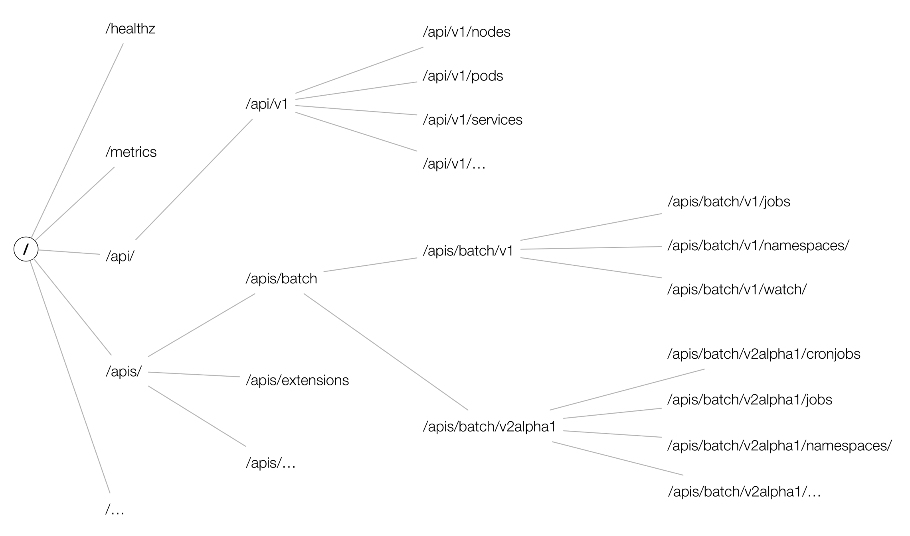

# RBAC权限控制

---

对于资源对象的操作都是通过 APIServer 进行的，那么集群是怎样知道我们的请求就是合法的请求呢？这个就需要了解 Kubernetes 中另外一个非常重要的知
识点了：RBAC（基于角色的权限控制）。

管理员可以通过 Kubernetes API 动态配置策略来启用RBAC，需要在 kube-apiserver 中添加参数--authorization-mode=RBAC，如果使用的kubeadm
安装的集群那么是默认开启了 RBAC 的，可以通过查看 Master 节点上 apiserver 的静态 Pod 定义文件：

```
$ cat /etc/kubernetes/manifests/kube-apiserver.yaml 
...
    - --authorization-mode=Node,RBAC
...
```

如果是二进制的方式搭建的集群，添加这个参数过后，记得要重启 kube-apiserver 服务。

## API 对象

在 Kubernetes 集群中，一个 API 对象在 Etcd 里的完整资源路径，是由：Group（API 组）、Version（API 版本）和 Resource（API 资源类型）
三个部分组成的。通过这样的结构，整个 Kubernetes 里的所有 API 对象，实际上就可以用如下的树形结构表示出来：


## RBAC

Kubernetes 所有资源对象都是模型化的 API 对象，允许执行 CRUD(Create、Read、Update、Delete) 操作(也就是我们常说的增、删、改、查操作)，

比如下面的这些资源：Pods,ConfigMaps,Deployments,Nodes,Secrets,Namespaces...

对于上面这些资源对象的可能存在的操作有：create,get,delete,list,update,edit,watch,exec,patch

在更上层，这些资源和 API Group 进行关联，比如 Pods 属于 Core API Group，而 Deployements 属于 apps API Group，现在我们要在
Kubernetes 中通过 RBAC 来对资源进行权限管理，除了上面的这些资源和操作以外，我们还需要了解另外几个概念：

- Rule：规则，规则是一组属于不同 API Group 资源上的一组操作的集合
- Role 和 ClusterRole：角色和集群角色，这两个对象都包含上面的 Rules 元素，二者的区别在于，在 Role 中，定义的规则只适用于单个命名空间，
  也就是和 namespace 关联的，而 ClusterRole 是集群范围内的，因此定义的规则不受命名空间的约束。另外 Role 和 ClusterRole 在Kubernetes
  中都被定义为集群内部的 API 资源，和我们前面学习过的 Pod、Deployment 这些对象类似，都是我们集群的资源对象，所以同样的可以使用 YAML 文件来
  描述，用 kubectl 工具来管理
- Subject：主题，对应集群中尝试操作的对象，集群中定义了3种类型的主题资源：
    - User Account：用户，这是有外部独立服务进行管理的，管理员进行私钥的分配，用户可以使用 KeyStone 或者 Goolge 帐号，甚至一个用户名和密码
      的文件列表也可以。对于用户的管理集群内部没有一个关联的资源对象，所以用户不能通过集群内部的 API 来进行管理
    - Group：组，这是用来关联多个账户的，集群中有一些默认创建的组，比如 cluster-admin
    - Service Account：服务帐号，通过 Kubernetes API 来管理的一些用户帐号，和 namespace 进行关联的，适用于集群内部运行的应用程序，需要
      通过 API 来完成权限认证，所以在集群内部进行权限操作，我们都需要使用到 ServiceAccount，这也是我们这节课的重点
- RoleBinding 和 ClusterRoleBinding：角色绑定和集群角色绑定，简单来说就是把声明的 Subject 和我们的 Role 进行绑定的过程（给某个用户绑定
  上操作的权限），二者的区别也是作用范围的区别：RoleBinding 只会影响到当前 namespace 下面的资源操作权限，而 ClusterRoleBinding 会影响到
  所有的 namespace。

## 示例

### 只能访问某个 namespace 的普通用户

我们想要创建一个 User Account，只能访问 kube-system 这个命名空间，对应的用户信息如下所示：

```
username: cnych
group: youdianzhishi
```

#### 创建用户凭证

Kubernetes 没有 User Account 的 API 对象，不过要创建一个用户帐号的话也是挺简单的，利用管理员分配给你的一个私钥就可以创建了，这个我们可以
参考官方文档中的方法，这里我们来使用 OpenSSL 证书来创建一个 User，当然我们也可以使用更简单的 cfssl工具来创建：

给用户 cnych 创建一个私钥，命名成 cnych.key：
```
$ openssl genrsa -out cnych.key 2048
Generating RSA private key, 2048 bit long modulus
..............................................................................+++
..............................................................................................................................................+++
e is 65537 (0x10001)
```

使用我们刚刚创建的私钥创建一个证书签名请求文件：cnych.csr，要注意需要确保在-subj参数中指定用户名和组(CN表示用户名，O表示组)：
```
$ openssl req -new -key cnych.key -out cnych.csr -subj "/CN=cnych/O=youdianzhishi"
```

然后找到我们的 Kubernetes 集群的 CA 证书，我们使用的是 kubeadm 安装的集群，CA 相关证书位于 /etc/kubernetes/pki/ 目录下面，如果你是
二进制方式搭建的，你应该在最开始搭建集群的时候就已经指定好了 CA 的目录，我们会利用该目录下面的 ca.crt 和 ca.key两个文件来批准上面的证书请求。
生成最终的证书文件，我们这里设置证书的有效期为 500 天：
```
$ openssl x509 -req -in cnych.csr -CA /etc/kubernetes/pki/ca.crt -CAkey /etc/kubernetes/pki/ca.key -CAcreateserial -out cnych.crt -days 500
Signature ok
subject=/CN=cnych/O=youdianzhishi
Getting CA Private Key
```

现在查看我们当前文件夹下面是否生成了一个证书文件：
```
$ ls
cnych.crt  cnych.csr  cnych.key
```

现在我们可以使用刚刚创建的证书文件和私钥文件在集群中创建新的凭证和上下文(Context):
```
$ kubectl config set-credentials cnych --client-certificate=cnych.crt --client-key=cnych.key
User "cnych" set.
```

我们可以看到一个用户 cnych 创建了，然后为这个用户设置新的 Context，我们这里指定特定的一个 namespace：
```
$ kubectl config set-context cnych-context --cluster=kubernetes --namespace=kube-system --user=cnych
Context "cnych-context" created.
```

到这里，我们的用户 cnych 就已经创建成功了，现在我们使用当前的这个配置文件来操作 kubectl 命令的时候，应该会出现错误，因为我们还没有为该用户
定义任何操作的权限呢：
```
$ kubectl get pods --context=cnych-context
Error from server (Forbidden): pods is forbidden: User "cnych" cannot list resource "pods" in API group "" in the namespace "kube-system"
```

#### 创建角色


用户创建完成后，接下来就需要给该用户添加操作权限，我们来定义一个 YAML 文件，创建一个允许用户操作 Deployment、Pod、ReplicaSets 的角色，如下定义：(cnych-role.yaml)
```
apiVersion: rbac.authorization.k8s.io/v1
kind: Role
metadata:
  name: cnych-role
  namespace: kube-system
rules:
- apiGroups: ["", "apps"]
  resources: ["deployments", "replicasets", "pods"]
  verbs: ["get", "list", "watch", "create", "update", "patch", "delete"] # 也可以使用['*']
```

其中 Pod 属于 core 这个 API Group，在 YAML 中用空字符就可以，而 Deployment 和 ReplicaSet 现在都属于 apps 这个 API Group（如果不知
道则可以用 kubectl explain 命令查看），所以 rules 下面的 apiGroups 就综合了这几个资源的 API Group：["", "apps"]，其中verbs 就是
我们上面提到的可以对这些资源对象执行的操作，我们这里需要所有的操作方法，所以我们也可以使用['*']来代替。然后直接创建这个 Role：

```
$ kubectl create -f cnych-role.yaml
role.rbac.authorization.k8s.io/cnych-role created
```

#### 创建角色权限绑定

Role 创建完成了，但是很明显现在我们这个 Role 和我们的用户 cnych 还没有任何关系，对吧？这里就需要创建一个 RoleBinding 对象，在 
kube-system 这个命名空间下面将上面的 cnych-role 角色和用户 cnych 进行绑定：（cnych-rolebinding.yaml）

```
apiVersion: rbac.authorization.k8s.io/v1
kind: RoleBinding
metadata:
  name: cnych-rolebinding
  namespace: kube-system
subjects:
- kind: User
  name: cnych
  apiGroup: ""
roleRef:
  kind: Role
  name: cnych-role
  apiGroup: rbac.authorization.k8s.io  # 留空字符串也可以，则使用当前的apiGroup
```

### 只能访问某个 namespace 的 ServiceAccount

上面我们创建了一个只能访问某个命名空间下面的普通用户，我们前面也提到过 subjects 下面还有一种类型的主题资源：ServiceAccount，现在我们来创建
一个集群内部的用户只能操作 kube-system 这个命名空间下面的 pods 和 deployments，首先来创建一个 ServiceAccount 对象：
```
$ kubectl create sa cnych-sa -n kube-system
```

当然我们也可以定义成 YAML 文件的形式来创建：
```
apiVersion: v1
kind: ServiceAccount
metadata:
  name: cnych-sa
  namespace: kube-system
```

然后新建一个 Role 对象：(cnych-sa-role.yaml)
```
apiVersion: rbac.authorization.k8s.io/v1
kind: Role
metadata:
  name: cnych-sa-role
  namespace: kube-system
rules:
- apiGroups: [""]
  resources: ["pods"]
  verbs: ["get", "watch", "list"]
- apiGroups: ["apps"]
  resources: ["deployments"]
  verbs: ["get", "list", "watch", "create", "update", "patch", "delete"]
```

然后创建一个 RoleBinding 对象，将上面的 cnych-sa 和角色 haimaxy-sa-role 进行绑定：(haimaxy-sa-rolebinding.yaml)
```
kind: RoleBinding
apiVersion: rbac.authorization.k8s.io/v1
metadata:
  name: cnych-sa-rolebinding
  namespace: kube-system
subjects:
- kind: ServiceAccount
  name: cnych-sa
  namespace: kube-system
roleRef:
  kind: Role
  name: cnych-sa-role
  apiGroup: rbac.authorization.k8s.io
```

然后我们怎么去验证这个 ServiceAccount 呢？我们前面的课程中是不是提到过一个 ServiceAccount 会生成一个 Secret 对象和它进行映射，这个 
Secret 里面包含一个 token，我们可以利用这个 token 去登录 Dashboard，然后我们就可以在 Dashboard 中来验证我们的功能是否符合预期了：
```
$ kubectl get secret -n kube-system |grep cnych-sa
cnych-sa-token-nxgqx                  kubernetes.io/service-account-token   3         47m
$ kubectl get secret cnych-sa-token-nxgqx -o jsonpath={.data.token} -n kube-system |base64 -d
# 会生成一串很长的base64后的字符串
```

### 可以全局访问的 ServiceAccount

刚刚我们创建的 cnych-sa 这个 ServiceAccount 和一个 Role 角色进行绑定的，如果我们现在创建一个新的 ServiceAccount，需要他操作的权限作用于
所有的 namespace，这个时候我们就需要使用到 ClusterRole 和 ClusterRoleBinding 这两种资源对象了。同样，首先新建一个 ServiceAcount 
对象：(cnych-sa2.yaml)

```
apiVersion: v1
kind: ServiceAccount
metadata:
  name: cnych-sa2
  namespace: kube-system
```

然后创建一个 ClusterRoleBinding 对象（cnych-clusterolebinding.yaml）:
```
kind: ClusterRoleBinding
apiVersion: rbac.authorization.k8s.io/v1beta1
metadata:
name: cnych-sa2-clusterrolebinding
subjects:
- kind: ServiceAccount
  name: cnych-sa2
  namespace: kube-system
  roleRef:
  kind: ClusterRole
  name: cluster-admin
  apiGroup: rbac.authorization.k8s.io
```

从上面我们可以看到我们没有为这个资源对象声明 namespace，因为这是一个 ClusterRoleBinding 资源对象，是作用于整个集群的，我们也没有单独新建
一个 ClusterRole 对象，而是使用的 cluster-admin 这个对象，这是 Kubernetes 集群内置的 ClusterRole 对象，我们可以使用 
`kubectl get clusterrole` 和 `kubectl get clusterrolebinding` 查看系统内置的一些集群角色和集群角色绑定，这里我们使用的 
cluster-admin 这个集群角色是拥有最高权限的集群角色，所以一般需要谨慎使用该集群角色。